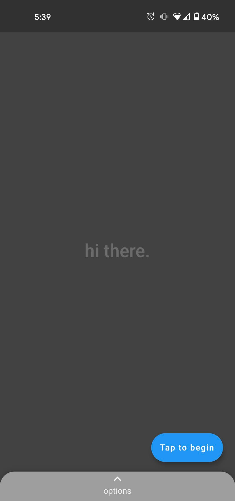
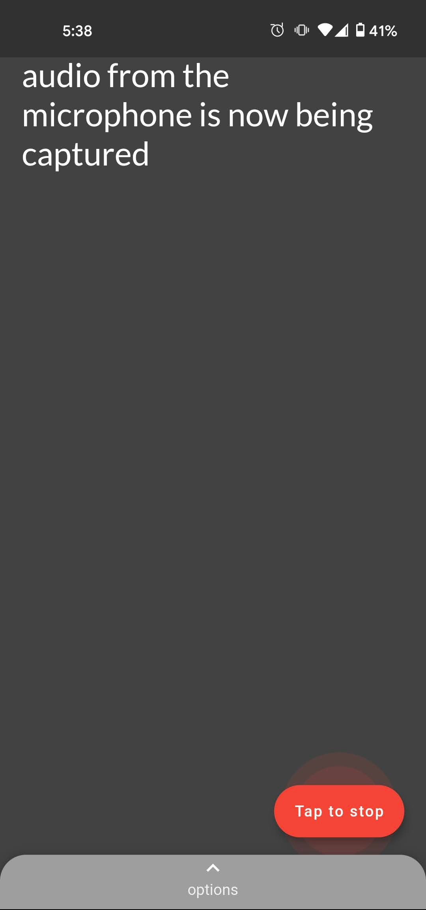
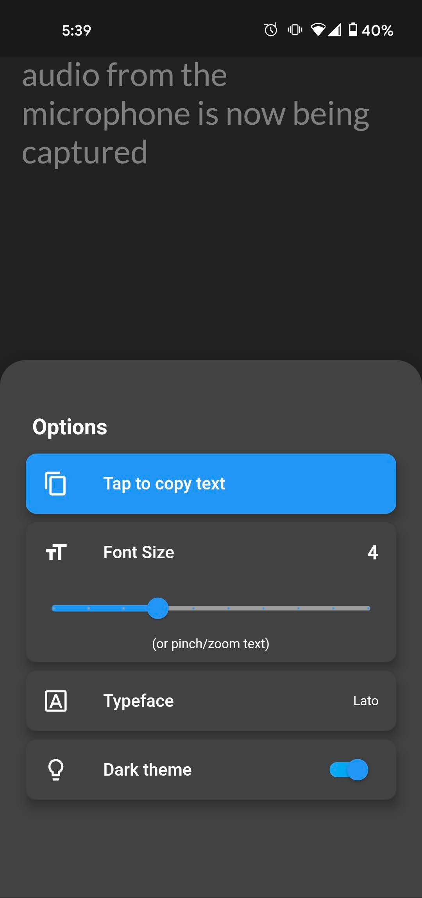
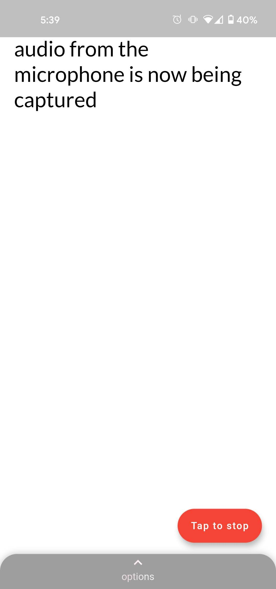

# Fonetic

An elegant, customizable, and accessable live transcription app that aims to break through barriers of communication. Using the microphone as audio input, Fonetic offers real-time offline speech transcription of the world around you. This project is built in Flutter and builds to both iOS and Android. 

| Dark theme    | Live Transcription |    Customize look & feel |   Light theme   |
| ------------- | ------------- | ------------- | ------------- |
|   |   |   |  |
